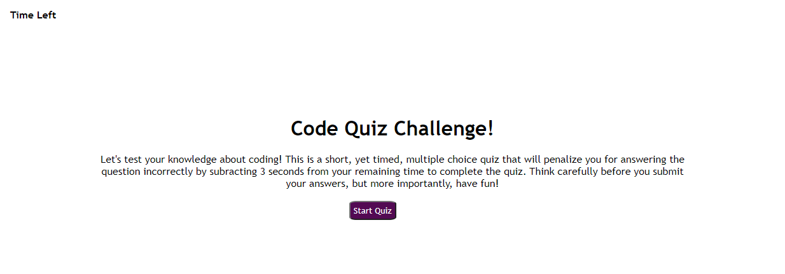

# Code Quiz

## Link to public repo on Github:

https://github.com/jcapadocia3/Code-Quiz

## Link to public Github page URL:

https://jcapadocia3.github.io/Code-Quiz/

## Final webpage project image:

## About Project

This project is intended to present a user with a timed Quiz that includes a responsive UI in which a user can click buttons to answer the questions presented to them in large text. When the user completes the Quiz, he/she will be able to enter their initials to record their highscore and have the option to replay the Quiz should they want to play again.

### How the project functions

- The user will be presented with an introduction to the project and the guidelines for how the Quiz operates. When the user is ready to participate, they can click the "Start Quiz" button to begin.

- Once the Quiz is started, a timer will begin to count down from 60 seconds in the top left corner as the user completes the Quiz from start to end. Should the timer end before the user is finished, the game will automatically end.

- While the time is running, the user will be presented with one question at a time, in which they will have 4 separate buttons to click that will contain the possible answers they can select. Depending on the answer that the user clicks, their score will either increase by 1 or 5 seconds will be reduced from the time remaining for the Quiz to be completed. Also, once an answer is selected, the Quiz will automatically move to the next question until either the timer has run down to 0 seconds or the user has answered all of the questions in the Quiz.

- Once the Quiz is finished, the user will be presented with their final score and a required submission form to complete in which they will enter their initials to have their score saved. The user will then be able to see a list of scores saved from other completions and will have the option to replay the Quiz or clear the scores that are saved.
